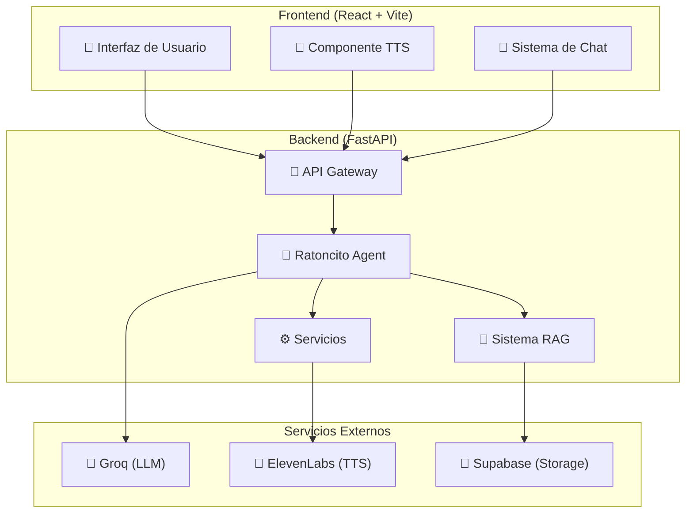
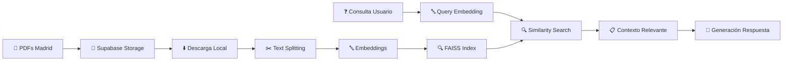

# 🐭 Ratoncito Pérez - Guía Mágica de Madrid

> **Un asistente conversacional inteligente que combina IA, RAG y síntesis de voz para crear experiencias turísticas inmersivas en Madrid**

[](https://fastapi.tiangolo.com/)
[](https://reactjs.org/)
[](https://langchain.com/)
[](https://groq.com/)
[](https://elevenlabs.io/)

## 📋 Tabla de Contenidos

- [🎯 Descripción del Proyecto](#-descripción-del-proyecto)
- [🏗️ Arquitectura del Sistema](#️-arquitectura-del-sistema)
- [🚀 Tecnologías Utilizadas](#-tecnologías-utilizadas)
- [📁 Estructura del Proyecto](#-estructura-del-proyecto)
- [⚙️ Instalación y Configuración](#️-instalación-y-configuración)
- [🔌 APIs y Endpoints](#-apis-y-endpoints)
- [🤖 Sistema de Agentes](#-sistema-de-agentes)
- [🎵 Síntesis de Voz (TTS)](#-síntesis-de-voz-tts)
- [💾 Sistema RAG](#-sistema-rag)
- [🎮 Uso de la Aplicación](#-uso-de-la-aplicación)
- [🔧 Configuración Avanzada](#-configuración-avanzada)
- [📊 Gestión del Proyecto](#-gestión-del-proyecto)
- [👥 Equipo de Desarrollo](#-equipo-de-desarrollo) 

## 🎯 Descripción del Proyecto

**Ratoncito Pérez** es un MVP de asistente conversacional inteligente diseñado para ser el guía turístico perfecto de Madrid. Combina tecnologías de vanguardia en IA para ofrecer:

- 🗣️ **Conversaciones naturales** con personalidad adaptativa (niños/adultos)
- 🧠 **Conocimiento especializado** sobre Madrid mediante RAG (Retrieval-Augmented Generation)
- 🎵 **Síntesis de voz realista** con ElevenLabs
- 🎯 **Recomendaciones personalizadas** basadas en el perfil del usuario
- 🎲 **Acertijos y juegos** para hacer la experiencia más divertida
- 📱 **Interfaz moderna** con React y Material-UI

## 🏗️ Arquitectura del Sistema



## 🚀 Tecnologías Utilizadas

### Backend
- **🐍 Python 3.11+** - Lenguaje principal
- **⚡ FastAPI** - Framework web moderno y rápido
- **🦜 LangChain** - Framework para aplicaciones con LLM
- **🚀 Groq** - Inferencia ultrarrápida de LLM (Llama-3.3-70B-Versatile)
- **🎵 ElevenLabs** - Síntesis de voz de alta calidad
- **🔍 FAISS** - Búsqueda vectorial para RAG
- **💾 Supabase** - Base de datos y almacenamiento
- **📄 PyPDF** - Procesamiento de documentos PDF
- **🔤 Sentence Transformers** - Embeddings semánticos

### Frontend
- **⚛️ React 19** - Biblioteca de interfaz de usuario
- **⚡ Vite** - Herramienta de construcción rápida
- **🎨 Material-UI (MUI)** - Componentes de diseño
- **🎭 Framer Motion** - Animaciones fluidas
- **🌐 React Router** - Navegación SPA
- **📝 React Markdown** - Renderizado de markdown
- **📡 Axios** - Cliente HTTP

## 📁 Estructura del Proyecto

```
G7_hack_Agentes/
├── 📁 backend/
│   ├── 📁 app/
│   │   ├── 🤖 agents/
│   │   │   └── ratoncito_agent.py      # Agente principal con ReAct
│   │   ├── ⚙️ core/
│   │   │   └── config.py               # Configuración centralizada
│   │   ├── 💾 database/                # Modelos de base de datos
│   │   ├── 🔌 routes/
│   │   │   ├── agent_routes.py         # Endpoints del agente
│   │   │   ├── narrative_routes.py     # Rutas de narrativas
│   │   │   └── storytelling_routes.py  # Rutas de actividades
│   │   ├── 🛠️ services/
│   │   │   ├── knowledge.py            # Sistema RAG
│   │   │   ├── tts_service.py          # Síntesis de voz
│   │   │   ├── tourism.py              # Datos turísticos
│   │   │   ├── riddles.py              # Generador de acertijos
│   │   │   └── web_search_service.py   # Búsqueda web
│   │   └── 🔧 utils/                   # Utilidades y prompts
│   ├── main.py                         # Punto de entrada
│   ├── requirements.txt                # Dependencias Python
│   └── .env.example                    # Variables de entorno
├── 📁 frontend/
│   ├── 📁 src/
│   │   ├── 📁 components/
│   │   │   └── Chat/
│   │   │       ├── Chat.jsx            # Componente principal de chat
│   │   │       ├── AudioButton.jsx     # Botón de síntesis de voz
│   │   │       ├── TTSDemo.jsx         # Demo de TTS
│   │   │       └── TTSShowcase.jsx     # Showcase completo
│   │   ├── 📁 hooks/
│   │   │   └── useTTS.js               # Hook personalizado para TTS
│   │   ├── 📁 services/
│   │   │   └── ttsService.js           # Cliente TTS
│   │   ├── 📁 pages/                   # Páginas de la aplicación
│   │   └── App.jsx                     # Componente raíz
│   ├── 📁 public/
│   │   └── audios/                     # Archivos de audio generados
│   ├── package.json                    # Dependencias Node.js
│   └── vite.config.js                  # Configuración de Vite
└── README.md                           # Este archivo
```
wiki: https://deepwiki.com/IgnacioCastilloFranco/G7_hack_Agentes

## ⚙️ Instalación y Configuración

### Prerrequisitos
- Python 3.11+
- Node.js 18+
- npm o yarn

### 1. Clonar el Repositorio
```bash
git clone <repository-url>
cd G7_hack_Agentes
```

### 2. Configurar Backend
```bash
cd backend

# Crear entorno virtual
python -m venv venv
source venv/bin/activate  # En Windows: venv\Scripts\activate

# Instalar dependencias
pip install -r requirements.txt

# Configurar variables de entorno
cp .env.example .env
# Editar .env con tus API keys
```

### 3. Configurar Frontend
```bash
cd ../frontend

# Instalar dependencias
npm install

# Crear carpeta de audios
mkdir -p public/audios
```

### 4. Variables de Entorno Requeridas

Edita el archivo `backend/.env`:

```env
# APIs Requeridas
GROQ_API_KEY=tu_groq_api_key
ELEVENLABS_API_KEY=tu_elevenlabs_api_key

# Supabase (para RAG)
SUPABASE_URL=tu_supabase_url
SUPABASE_ANON_KEY=tu_supabase_anon_key
SUPABASE_BUCKET=documentos-madrid

# Configuración del LLM
LLM_MODEL=Llama-3.3-70B-Versatile
LLM_TEMPERATURE=0.2
LLM_MAX_TOKENS=1500

# Configuración del Agente
AGENT_VERBOSE=true
AGENT_MAX_ITERATIONS=4
RATONCITO_PERSONALITY=magical_guide
```

### 5. Ejecutar la Aplicación

**Terminal 1 - Backend:**
```bash
cd backend
python -m uvicorn app.main:app --reload --host 0.0.0.0 --port 8000
```

**Terminal 2 - Frontend:**
```bash
cd frontend
npm run dev
```

🎉 **¡Listo!** Accede a:
- **Frontend:** http://localhost:5173
- **Backend API:** http://localhost:8000
- **Documentación API:** http://localhost:8000/docs

## 🔌 APIs y Endpoints

### 🤖 Agente Principal

#### `POST /ratoncito/chat`
Conversación principal con el Ratoncito Pérez.

**Request:**
```json
{
  "message": "Hola, me llamo Ana y tengo 8 años",
  "session_id": "user_123"
}
```

**Response:**
```json
{
  "response": "¡Hola Ana! ¡Qué maravilla tener 8 años! ¿Quieres que te cuente un secreto o prefieres un acertijo para empezar?",
  "success": true,
  "session_id": "user_123"
}
```

### 🎵 Síntesis de Voz

#### `POST /ratoncito/speak`
Convierte texto a audio usando ElevenLabs.

**Request:**
```json
{
  "text": "¡Hola! Soy el Ratoncito Pérez",
  "voice_id": "pNInz6obpgDQGcFmaJgB",
  "model_id": "eleven_multilingual_v2",
  "stability": 0.5,
  "similarity_boost": 0.8,
  "speed": 1.0
}
```

**Response:** Archivo de audio MP3

#### `GET /ratoncito/voices`
Obtiene las voces disponibles en ElevenLabs.

**Response:**
```json
{
  "voices": [
    {
      "voice_id": "pNInz6obpgDQGcFmaJgB",
      "name": "Adam",
      "category": "premade"
    }
  ],
  "success": true
}
```

### 📚 Narrativas y Actividades

#### `GET /narrative/places`
Obtiene lugares disponibles para narrativas.

#### `POST /activities/create-story`
Genera historias personalizadas basadas en lugares de Madrid.

## 🤖 Sistema de Agentes

### Arquitectura ReAct

El **RatoncitoAgent** utiliza el patrón **ReAct** (Reasoning + Acting) de LangChain:

1. **🧠 Reasoning:** Analiza la consulta del usuario
2. **🔧 Acting:** Selecciona y ejecuta herramientas apropiadas
3. **📝 Observation:** Procesa los resultados
4. **🔄 Iteration:** Repite hasta obtener una respuesta completa

### Herramientas Disponibles

| Herramienta | Descripción | Uso |
|-------------|-------------|-----|
| `buscar_informacion_en_documentos_magicos` | Sistema RAG principal | Consultas sobre Madrid |
| `consultar_datos_oficiales_madrid` | APIs oficiales de Madrid | Eventos, transporte |
| `crear_acertijo_magico` | Generador de acertijos | Entretenimiento infantil |
| `recomendar_lugares_emblematicos` | Recomendaciones básicas | Fallback general |

### Gestión de Contexto

```python
class ConversationContext:
    def __init__(self):
        self.user_profile = {
            "type": "unknown",  # "niño" o "adulto"
            "name": None,
            "age": None
        }
```

- **Detección automática** de nombre y edad
- **Personalización** de respuestas según el perfil
- **Memoria conversacional** persistente por sesión

## 🎵 Síntesis de Voz (TTS)

### Integración con ElevenLabs

El sistema TTS está completamente integrado en la interfaz:

```javascript
// Hook personalizado para TTS
const { speak, isLoading, isPlaying, toggle } = useTTS();

// Uso en componentes
<AudioButton 
  text={message.content}
  size="medium"
  disabled={isLoading}
/>
```

### Características
- ✅ **Reproducción automática** al generar audio
- ✅ **Control de reproducción** (play/pause/stop)
- ✅ **Indicadores visuales** de estado
- ✅ **Almacenamiento local** de archivos de audio
- ✅ **Configuración avanzada** de parámetros de voz

### Configuración de Voz

```javascript
const defaultOptions = {
  voice_id: "pNInz6obpgDQGcFmaJgB", // Adam (ElevenLabs)
  model_id: "eleven_multilingual_v2",
  stability: 0.5,
  similarity_boost: 0.8,
  speed: 1.0
};
```

## 💾 Sistema RAG

### Arquitectura de Conocimiento



### Proceso RAG

1. **📥 Ingesta de Documentos**
   - Descarga automática desde Supabase
   - Procesamiento de PDFs con PyPDF
   - Segmentación inteligente de texto

2. **🔤 Generación de Embeddings**
   - Modelo: `sentence-transformers`
   - Vectorización semántica
   - Indexación con FAISS

3. **🔍 Búsqueda Semántica**
   - Consulta vectorizada
   - Búsqueda por similitud
   - Ranking de relevancia

4. **🤖 Generación Aumentada**
   - Contexto inyectado en el prompt
   - Respuesta fundamentada en documentos
   - Citas y referencias automáticas

## 🎮 Uso de la Aplicación

### 1. Página Principal (`/`)
- Introducción al Ratoncito Pérez
- Navegación a diferentes secciones

### 2. Chat de Aventura (`/aventura`)
```
Usuario: "Hola, me llamo Carlos y tengo 25 años"
Ratoncito: "¡Hola Carlos! Con 25 años, seguro que aprecias los secretos de la ciudad. ¿Sobre qué lugar te gustaría saber más?"

Usuario: "Cuéntame sobre el Palacio Real"
Ratoncito: "¡Por mis bigotitos! El Palacio Real es uno de mis lugares favoritos..."
[🎵 Botón de audio aparece automáticamente]
```

### 3. Demo TTS (`/tts-demo`)
- Configuración avanzada de parámetros
- Prueba de diferentes voces
- Ajuste de velocidad y estabilidad

### 4. Showcase TTS (`/tts-showcase`)
- Demostración completa de funcionalidades
- Ejemplos de uso
- Casos de prueba

## 🔧 Configuración Avanzada

### Personalización del Agente

```python
# En config.py
RATONCITO_PERSONALITY = "magical_guide"  # o "educational", "playful"
AGENT_MAX_ITERATIONS = 4  # Máximo de iteraciones ReAct
LLM_TEMPERATURE = 0.2  # Creatividad vs. precisión
```

### Optimización de Rendimiento

```python
# Configuración de memoria
CONVERSATION_MEMORY_SIZE = 10  # Mensajes en memoria

# Cache de embeddings
EMBEDDING_CACHE_SIZE = 1000  # Vectores en cache

# Configuración FAISS
FAISS_INDEX_TYPE = "IndexFlatIP"  # Producto interno
```

### Variables de Entorno Opcionales

```env
# Configuración avanzada
AGENT_TYPE=react
RATONCITO_DEFAULT_LOCATION=Madrid Centro
LLM_PROVIDER=groq

# Debug y logging
AGENT_VERBOSE=true
LOG_LEVEL=INFO

# Límites de recursos
MAX_CONCURRENT_REQUESTS=10
REQUEST_TIMEOUT=30
```

## 📊 Gestión del Proyecto

**Enlace al proyecto:** [Gestión en GitHub Projects](https://github.com/users/IgnacioCastilloFranco/projects/3)

### Metodología
- ✅ **Desarrollo Ágil** con sprints semanales
- ✅ **MVP-First** approach
- ✅ **Integración Continua** con testing automático
- ✅ **Documentación** como código

### Estado Actual
- 🟢 **Backend:** Completamente funcional
- 🟢 **Frontend:** Interfaz moderna y responsiva
- 🟢 **TTS:** Integración completa con ElevenLabs
- 🟢 **RAG:** Sistema de conocimiento operativo
- 🟢 **Agente:** ReAct pattern implementado

---

## 🤝 Contribuciones

Este proyecto es parte del **Bootcamp de IA - G7 Hack Agentes**. Para contribuir:

1. Fork del repositorio
2. Crear rama feature (`git checkout -b feature/nueva-funcionalidad`)
3. Commit cambios (`git commit -am 'Añadir nueva funcionalidad'`)
4. Push a la rama (`git push origin feature/nueva-funcionalidad`)
5. Crear Pull Request

---

## 👥 Equipo de Desarrollo

Este proyecto ha sido posible gracias al trabajo colaborativo de nuestro equipo del **Bigotitos de Madrid**:

1. **Max Beltran**  
   - [LinkedIn](https://www.linkedin.com/in/max-beltran/)  
   - [GitHub](https://github.com/mr-melenas)

2. **Alejandro Rajado**  
   - [LinkedIn](https://www.linkedin.com/in/alejandro-rajado-martín/)  
   - [GitHub](https://github.com/Alex-rajas)

3. **Nhoeli Salazar**  
   - [LinkedIn](https://www.linkedin.com/in/nhoeli-salazar/)  
   - [GitHub](https://github.com/Nho89)

4. **Ignacio Castillo**  
   - [LinkedIn](https://www.linkedin.com/in/ignacio-castillo-franco/)  
   - [GitHub](https://github.com/IgnacioCastilloFranco)

5. **Lady Berrocal**  
   - [LinkedIn](https://www.linkedin.com/in/ladyberrocal/) 
   - [GitHub](https://github.com/nikaLPFB)

6. **María Dunaeva**  
   - [LinkedIn](https://www.linkedin.com/in/mar%C3%ADa-dunaeva/)  
   - [GitHub](https://github.com/MariaDunaeva1)
---

## 📄 Licencia

Este proyecto está bajo la Licencia MIT. Ver `LICENSE` para más detalles.
---

**¡Por mis bigotitos! 🐭✨ ¡Gracias por usar el Ratoncito Pérez!**
